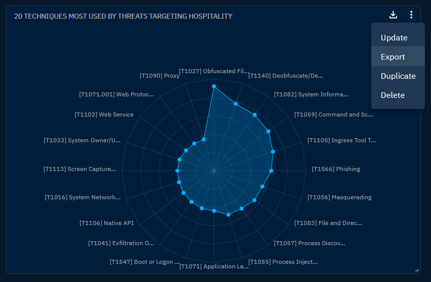

# Custom dashboards

OpenCTI provides an adaptable and entirely customizable dashboard functionality. The flexibility of OpenCTI's dashboard ensures a tailored and insightful visualization of data, fostering a comprehensive understanding of the platform's knowledge, relationships, and activities.


## Dashboard overview

You have the flexibility to tailor the arrangement of [widgets](widgets.md) on your dashboard, optimizing organization and workflow efficiency. Widgets can be intuitively placed to highlight key information. Additionally, dynamically resize widgets from the bottom right corner based on the importance of the information, enabling adaptation to specific analytical needs. This technical flexibility ensures a fluid, visually optimized user experience.

Moreover, the top banner of the dashboard offers a convenient feature to configure the timeframe for displayed data. This can be accomplished through the selection of a relative time period, such as "Last 7 days", or by specifying fixed "Start" and "End" dates, allowing users to precisely control the temporal scope of the displayed information.


## Access control

In OpenCTI, the power to create custom dashboards comes with a flexible access control system, allowing users to tailor visibility and rights according to their collaborative needs.
Access Restrictions:

When a user crafts a personalized dashboard, by default, it remains visible only to the dashboard creator. At this stage, the creator holds administrative access rights. However, they can extend access and rights to others using the "Manage access" button, denoted by a locker icon, located at the top right of the dashboard page.


**Levels of access:**

- View: Access to view the dashboard. 
- Edit: View + Permission to modify and update the dashboard and its widgets. 
- Manage: Edit + Ability to delete the dashboard and to control user access and rights.

It's crucial to emphasize that at least one user must retain admin access to ensure ongoing management capabilities for the dashboard.

 

!!! note "Knowledge access restriction"

    The platform's data access restrictions also apply to dashboards. The data displayed in the widgets is subject to the user's access rights within the platform. Therefore, an admin user will not see the same results in the widgets as a user with limited access, such as viewing only TLP:CLEAR data (assuming the platform contains data beyond TLP:CLEAR). 


## Share dashboard and widget configurations

OpenCTI provides functionality for exporting, importing and duplicating dashboard and widget configurations, facilitating the seamless transfer of customized dashboard setups between instances or users.

### Export

Dashboards can be exported from either the custom dashboards list or the dashboard view. 

To export a dashboard configuration from the custom dashboards list:

1. Click on the burger menu button at the end of the dashboard line.
2. Select `Export`.


To export a widget, the same mechanism is used, but from the burger menu button in the upper right-hand corner of the widget.



To export a dashboard configuration from the dashboard view:

1. Navigate to the desired dashboard.
2. Click on the `Export to JSON` button (file with an arrow pointing to the top right corner) located in the top-right corner of the dashboard.


#### Configuration file

The dashboard configuration will be saved as a JSON file, with the title formatted as `[YYYYMMDD]_octi_dashboard_[dashboard title]`. The expected configuration file content is as follows:

```JSON
{
  "openCTI_version": "5.12.0",
  "type": "dashboard",
  "configuration": {
    "name": "My dashboard title",
    "manifest": "eyJ3aWRn(...)uZmlnIjp7fX0="
  }
}
```

The widget configuration will be saved as a JSON file, with the title formatted as `[YYYYMMDD]_octi_widget_[widget view]`. The expected configuration file content is as follows:

```JSON
{
  "openCTI_version": "5.12.0",
  "type": "widget",
  "configuration": "eyJ0eXB(...)iOmZhbHNlfX0="
}
```

!!! warning "Source platform-related filters"
    
    When exporting a dashboard or a widget configuration, all filters will be exported as is. Instance filters are based on internal platform IDs, requiring manual filter adjustment after importing a configuration from another user's platform. Our team is currently working to manage these instance filters.


### Import

Dashboards can be imported from the custom dashboards list:

1. Hover over the Add button (+) in the right bottom corner.
2. Click on the `Import dashboard` button (cloud with an upward arrow).
3. Select your file.


To import a widget, the same mechanism is used, but from a dashboard view.


!!! warning "Configuration compatibility"

    Only JSON files with the required properties will be accepted, including "openCTI_version: [version 5.12.0 and above]", "type: dashboard", and a "configuration". This applies to both dashboards and widgets configurations.


### Duplicate

Dashboards can be duplicated from either the custom dashboards list or the dashboard view.

To duplicate a dashboard from the custom dashboards list:

1. Click on the burger menu button at the end of the dashboard line.
2. Select `Duplicate`.

To duplicate a widget, the same mechanism is used, but from the burger menu button in the upper right-hand corner of the widget.

To duplicate a dashboard from the dashboard view:

1. Navigate to the desired dashboard.
2. Click on the `Duplicate dashboard` button (two stacked sheets) located in the top-right corner of the dashboard.


Upon successful duplication, a confirmation message is displayed for a short duration, accompanied by a link for easy access to the new dashboard view. Nevertheless, the new dashboard can still be found in the dashboards list.


!!! note "Dashboard access"

    The user importing or duplicating a dashboard becomes the only one with access to it. Then, access can be managed as usual.

