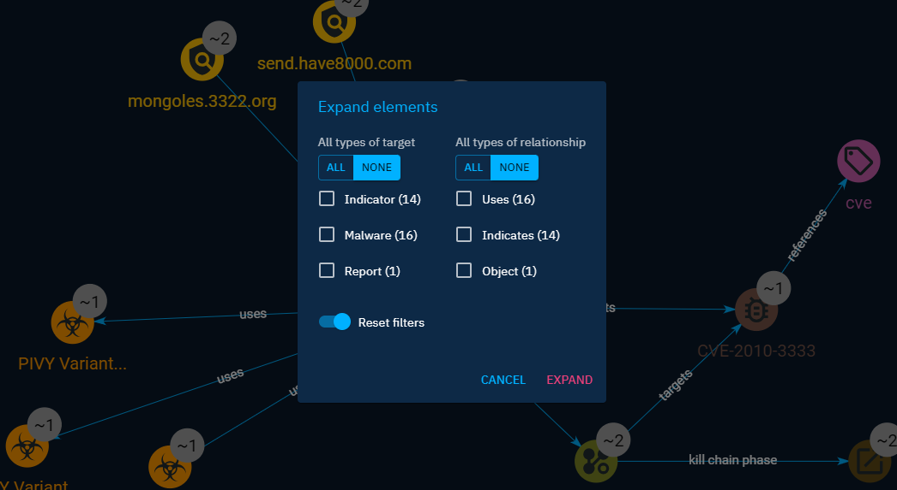

# Pivot and investigate

In Opencti, all data can be represented as a large knowledge graph: everything is linked to something. 
You can pivot on any entity and on any relationship you have in your platform, using investigations.

Investigations are available on the top right of the top bar:

Investigations are organized by workspace. When you create a new empty workspace, it will only be visible by you and enables you to work on your investigation before sharing it.

In your workspace, you can add entities that you want to investigate, visualize the data linked to these entities, add relationships, and export your investigation graph in pdf, image or as new stix report.

## Add and expand an entity

You can add any existing entity of the platform to your investigation.

Once added, you can select the entity, and see its details in the right. 
In this bottom right menu, right next to "Add en entity", you can expand the selected entity and select the number of linked entities you want to see in your investigation.

## Add a relationship

You can add a relationship between entities directly in your investigation.

## Export your investigation

You can export your investigation in PDF or image format. 
You can also download all the content of your investigation graph in a stix bundle report.

